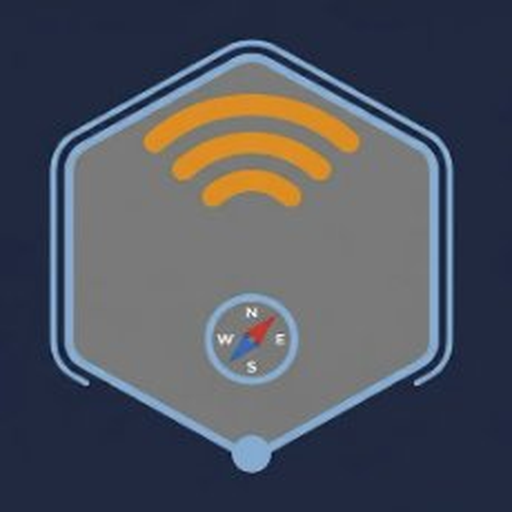

<div align="center">



# MeshNatter
### Your Desktop Gateway to the Meshtastic Network

</div>

[](https://www.buymeacoffee.com/nullobj)

---

## Overview
MeshNatter is a Windows desktop application designed to bridge the gap between your PC and the Meshtastic network. It allows users to connect to Meshtastic nodes over IP, providing an interface for network visualization, mapping, and messaging.

## Key Features
* **IP Connectivity:** Connect to Meshtastic nodes directly via TCP/IP or Wi-Fi.
* **Network Visualization:** Integrated map support to visualize nodes and signal paths.
* **Messaging Suite:** Full support for direct messages and channel broadcasts.
* **Telemetry Dashboard:** Monitor node status, battery levels, and environmental data.
* **Native Experience:** Built specifically for Windows 11 performance.

## Development
To clone the repository and begin working with the source code:

```bash
git clone [https://github.com/BeardedTech0o/meshnatter.git](https://github.com/BeardedTech0o/meshnatter.git)
